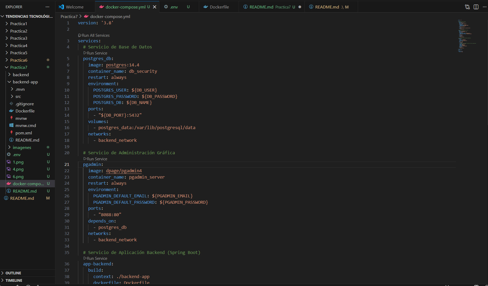
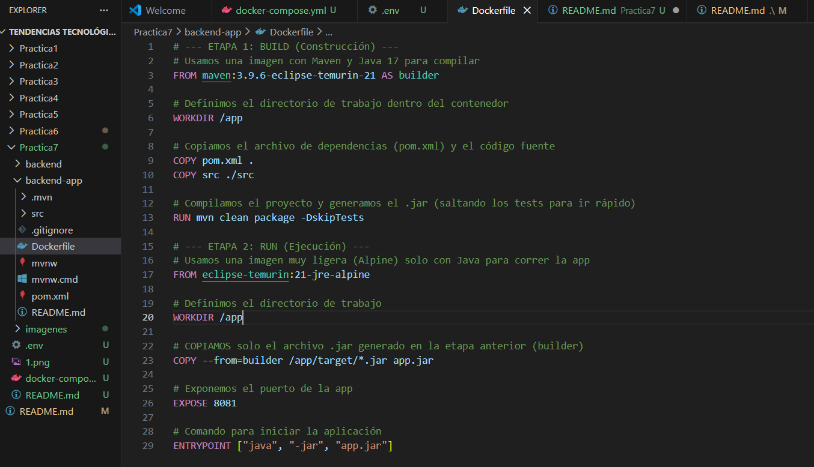
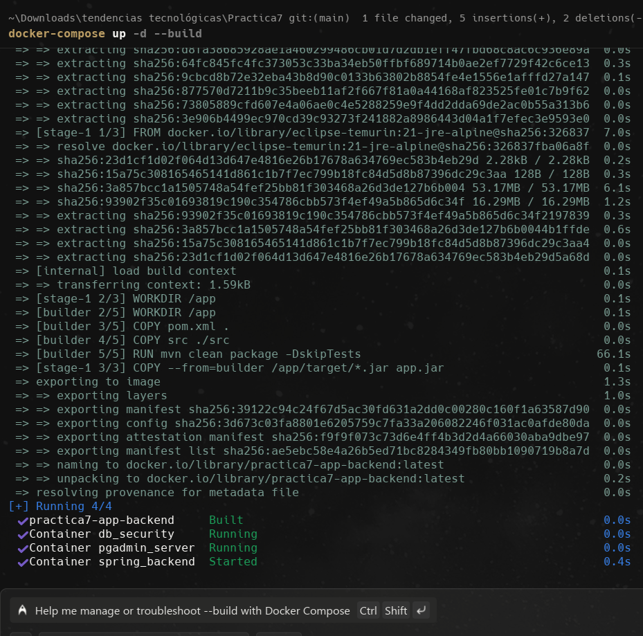
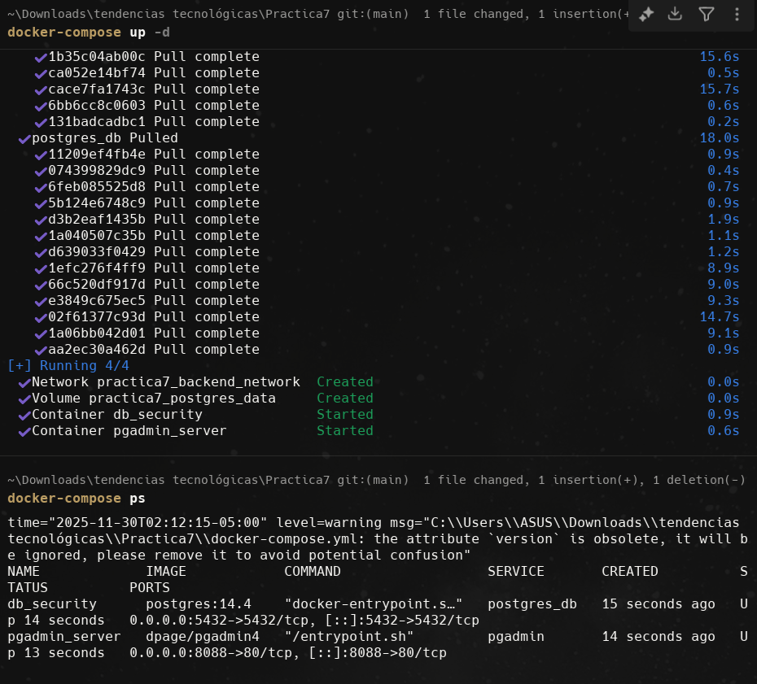
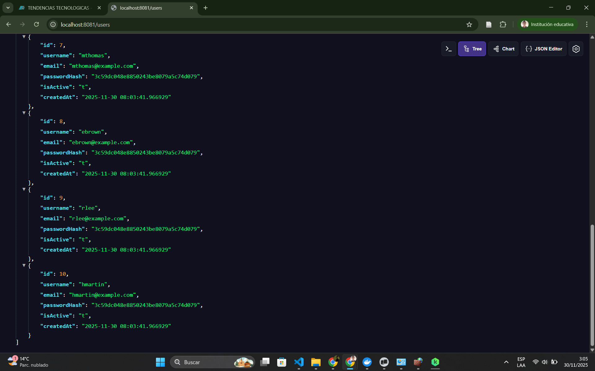

# Práctica No 7 - Despliegue Automatizado de Backend (Spring Boot + PostgreSQL)

## 1. Título
**Práctica No 7**: Orquestación de servicios Backend con Docker Compose, configuración Multi-stage y gestión segura de variables.

## 2. Tiempo de duración
Aproximadamente 2 horas.

## 3. Fundamentos
En esta práctica se automatizó el despliegue de una arquitectura de microservicios backend. Se aplicaron conceptos clave de la orquestación de servicios para coordinar la ejecución de todos los componentes de una aplicación a través de un archivo de configuración.

Los puntos técnicos destacados fueron:
* **Multi-stage Builds:** Se implementó un `Dockerfile` optimizado en dos etapas. La primera utiliza una imagen de Maven para compilar el código fuente y generar el artefacto ejecutable (`.jar`), mientras que la segunda utiliza una imagen ligera (`eclipse-temurin:21-jre-alpine`) solo para ejecutarlo.
* **Variables de Entorno:** Se utilizó un archivo `.env` para manejar información sensible como credenciales de base de datos. Esta información no se almacena en el repositorio, sino que es leída automáticamente por `docker-compose` durante el levantamiento.
* **Orquestación:** Se configuraron servicios interconectados (Base de datos, pgAdmin y Backend) asegurando que inicien en el orden correcto y compartan la misma red.

## 4. Conocimientos previos
* Programación en Java y framework Spring Boot.
* Lenguaje SQL y administración de PostgreSQL.
* Conceptos de redes en Docker (Bridge).
* Manejo de volúmenes para persistencia de datos.

## 5. Objetivos a alcanzar
* Configurar un entorno de base de datos PostgreSQL y pgAdmin mediante contenedores.
* Implementar un archivo `.env` para la inyección segura de credenciales.
* Desarrollar un `Dockerfile` optimizado utilizando la técnica Multi-stage con **Java 21**.
* Automatizar la compilación y despliegue de la aplicación backend mediante Docker Compose.
* Verificar la conectividad y respuesta de la API REST.

## 6. Equipo necesario
* **Computador:** DESKTOP-OM5U658 (Intel Core i7 240H, 32GB RAM).
* **Sistema Operativo:** Windows 11 Pro.
* **Software:** Docker Desktop, Visual Studio Code, Terminal (Warp).

## 7. Material de apoyo
* Guía de la semana 8: "Despliegue proyecto backend".
* Documentación oficial de Spring Boot y Docker.
* Repositorio base: `tendencias-mar22-security`.

## 8. Procedimiento

**Paso 1: Configuración de la Base de Datos.**
Se creó el archivo `docker-compose.yml` definiendo los servicios de `postgres_db` y `pgadmin`, configurando volúmenes persistentes y una red interna.
*Figura 1. Despliegue inicial de contenedores de base de datos.*

**Paso 2: Configuración del Dockerfile Multi-stage.**
Se creó un `Dockerfile` configurado para Java 21. Se definieron dos etapas: `builder` para compilar con Maven y la etapa final con `eclipse-temurin:21-jre-alpine` para ejecutar la aplicación de forma ligera.
*Figura 2. Archivo Dockerfile configurado en VS Code.*

**Paso 3: Construcción y Despliegue (Build).**
Se ejecutó el comando `docker-compose up -d --build`. Se solucionaron conflictos de versiones actualizando a Java 21, logrando una compilación exitosa.
*Figura 3. Proceso de construcción y descarga de capas exitoso.*

**Paso 4: Verificación de Contenedores.**
Se verificó mediante `docker-compose ps` que los tres servicios (`db_security`, `pgadmin_server` y `spring_backend`) estuvieran en estado "Up" o "Started".
*Figura 4. Estado de los contenedores en ejecución.*

**Paso 5: Prueba de Funcionamiento.**
Se accedió al endpoint `http://localhost:8081/users` desde el navegador. La respuesta JSON con la lista de usuarios confirma que el backend se conectó exitosamente a la base de datos PostgreSQL.
*Figura 5. Respuesta JSON del backend en el navegador.*

## 9. Resultados esperados
Se logró desplegar exitosamente una arquitectura backend completa. La aplicación Java fue compilada automáticamente dentro de Docker usando una configuración Multi-stage con Java 21. La conexión con PostgreSQL fue exitosa mediante el uso del nombre del servicio como host, y las credenciales se manejaron de forma segura mediante variables de entorno.

## 10. Bibliografía
* Miell, I., & Sayers, A. (2019). *Docker in practice*. Simon and Schuster.
* Guerrero, V. (2025). *Despliegue proyecto backend* (Material de la asignatura).